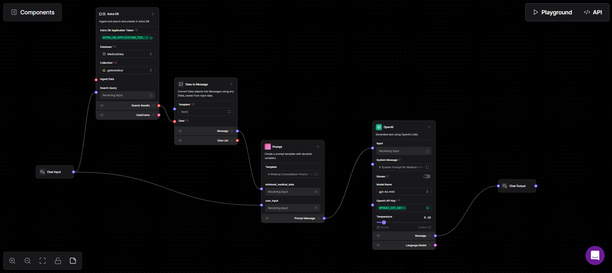

# Medical Assistant Chatbot 🩺

## Overview
This Medical Assistant Chatbot is an AI-powered application that provides health-related information and answers medical queries. Built using Streamlit and Langflow, the chatbot leverages a comprehensive medical knowledge base to offer informative responses.

## 🌟 Features
- AI-powered medical information retrieval (RAG)
- User-friendly Streamlit interface
- Real-time chat interaction
- Powered by Gale Medical Encyclopedia
- Secure API integration

## 🛠 Technologies Used
- Python
- Streamlit
- Langflow
- OpenAI API
- Requests library
- python-dotenv

## 🔍 Langflow Flow Diagram


The Langflow flow diagram illustrates the architectural design of the chatbot:
- **Chat Input**: User's medical query entry point
- **Astra DB**: A vector database thats stores all the data
- **Data to Message**: Converts input data to message format
- **Prompt**: Creates dynamic prompt template
- **OpenAI**: Generates responses using GPT model
- **Chat Output**: Delivers final response to user

## 🚀 Installation

### 1. Clone the Repository
```bash
git clone https://github.com/yourusername/medical-chatbot.git
cd medical-chatbot
```

### 2. Create Virtual Environment
```bash
python -m venv venv
source venv/bin/activate  # On Windows, use `venv\Scripts\activate`
```

### 3. Install Dependencies
```bash
pip install -r requirements.txt
```

### 4. Configure Environment Variables
Create a `.env` file in the project root and add:
```
APP_TOKEN=your_langflow_application_token
```

## 🏃 Running the Application
```bash
streamlit run app.py
```

## 🔍 Project Structure
```
medical-chatbot/
│
├── data/
│   └── gale_encyclopedia/           # Medical knowledge base
│
├── prompts/
│   ├── PROMPT_TEMPLATE.txt           # Prompt configuration
│   └── OPENAI_SYSTEM_PROMPT.txt      # System prompt settings
│
├── app.py                            # Streamlit application
├── .env                              # Environment variables
├── requirements.txt                  # Python dependencies
└── Medical_Chatbot.json              # Langflow flow export
```

## 🔐 Security and Disclaimer
This chatbot provides general medical information and should NOT be used as a substitute for professional medical advice. Always consult healthcare professionals for personalized medical guidance.
